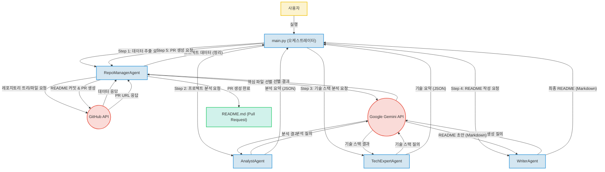

# LLM 기반 GitHub README 자동 생성 에이전트 (Unknown Project)

## 🌟 프로젝트 소개

본 프로젝트는 GitHub 레포지토리의 README.md 파일을 자동으로 생성하는 지능형 에이전트 시스템입니다. 최신 대규모 언어 모델(LLM)인 Google Gemini와 GitHub API를 활용하여 대상 레포지토리의 구조, 내용, 기술 스택을 분석하고, 이를 바탕으로 고품질의 README 문서를 자동으로 작성하여 Pull Request(PR) 형태로 발행합니다.

이 시스템은 복잡한 정보 처리와 문서 자동화를 LLM 기반 다단계 에이전트 시스템으로 구현함으로써 개발자의 문서화 부담을 줄이고 프로젝트의 일관된 문서 품질을 유지하는 데 기여합니다. (원본 저장소명: `Unknown Project`)

## ✨ 주요 기능

*   **GitHub 레포지토리 정보 추출**: GitHub API(PyGithub 라이브러리 활용)를 통해 대상 레포지토리의 파일 트리 및 내용을 안정적으로 추출합니다.
*   **LLM 기반 핵심 파일 선별**: Google Gemini API를 활용하여 레포지토리의 방대한 파일 중 프로젝트의 핵심을 파악하는 데 필요한 파일을 지능적으로 식별합니다.
*   **다단계 에이전트 분석 시스템**: `RepoManager`, `Analyst`, `TechExpert`, `Writer`의 네 가지 전문 에이전트가 협력하여 프로젝트 분석 및 README 생성을 수행합니다.
*   **프로젝트 구조 및 기능 분석**: `AnalystAgent`가 LLM을 통해 프로젝트의 전반적인 구조와 주요 기능을 심층적으로 파악합니다.
*   **기술 스택 및 아키텍처 분석**: `TechExpertAgent`가 LLM을 활용하여 사용된 기술 스택과 시스템 아키텍처를 정확하게 식별합니다.
*   **README.md 자동 생성**: `WriterAgent`가 취합된 분석 결과를 바탕으로 면접 및 포트폴리오 제출에 적합한 고품질의 README 초안을 마크다운 형식으로 작성합니다.
*   **GitHub Pull Request 자동 발행**: 생성된 README 파일을 대상 레포지토리에 Pull Request 형태로 제출하여 자동화된 문서 통합 워크플로우를 완성합니다.
*   **일관된 개발 환경**: `.devcontainer`를 통해 Visual Studio Code 기반의 일관된 개발 환경을 제공하여 팀원 간의 협업 효율성을 높입니다.
*   **보안적인 환경 변수 관리**: `python-dotenv`를 사용하여 API 키와 같은 민감 정보를 안전하게 환경 변수로 관리합니다.

## 📁 프로젝트 구조 (추정)

프로젝트는 `main.py` 파일이 오케스트레이터 역할을 하며, 여러 전문 에이전트 파일들이 모듈화되어 협력하는 구조를 가집니다.

```
.
├── .devcontainer/         # 일관된 개발 환경 설정 (VS Code Dev Containers)
│   └── devcontainer.json
├── .env.example           # 환경 변수 설정 예시
├── main.py                # 전체 워크플로우를 조율하는 오케스트레이터
├── agents/                # 각 에이전트 모듈 디렉토리 (추정)
│   ├── repomanager_agent.py # RepoManagerAgent 구현
│   ├── analyst_agent.py   # AnalystAgent 구현
│   ├── techexpert_agent.py# TechExpertAgent 구현
│   └── writer_agent.py    # WriterAgent 구현
└── requirements.txt       # 프로젝트 의존성 라이브러리
```

##  핵심 파일 설명

*   **`main.py`**:
    *   시스템의 진입점(Entry Point)이자 핵심 오케스트레이터입니다.
    *   `RepoManagerAgent`, `AnalystAgent`, `TechExpertAgent`, `WriterAgent` 등 각 에이전트의 실행 순서를 정의하고 제어합니다.
    *   에이전트 간의 데이터 흐름을 조율하고 전체 README 생성 워크플로우를 관리합니다.
*   **`RepoManagerAgent` (추정)**:
    *   GitHub API와의 통신을 담당하며, 대상 레포지토리의 파일 트리 및 내용을 추출합니다.
    *   LLM을 활용하여 프로젝트의 핵심이 되는 파일을 선별하는 역할을 수행합니다.
    *   최종적으로 생성된 README를 대상 레포지토리에 Pull Request 형태로 발행하는 기능을 구현합니다.
*   **`AnalystAgent` (추정)**:
    *   `RepoManagerAgent`가 추출한 데이터와 LLM(Google Gemini API)을 활용하여 프로젝트의 전반적인 구조와 주요 기능, 목적 등을 분석합니다.
    *   분석 결과를 구조화된 JSON 형태로 `main.py`에 전달합니다.
*   **`TechExpertAgent` (추정)**:
    *   프로젝트 코드와 문서를 분석하여 사용된 기술 스택(백엔드, 프론트엔드, 데이터베이스, DevOps 등) 및 시스템 아키텍처를 식별합니다.
    *   LLM을 통해 기술적 상세 정보를 추출하고 `main.py`에 전달합니다.
*   **`WriterAgent` (추정)**:
    *   `AnalystAgent`와 `TechExpertAgent`로부터 받은 분석 결과를 통합하여 README.md 문서 초안을 생성합니다.
    *   LLM을 활용하여 자연스럽고 체계적인 마크다운 문서를 작성하며, 필요한 섹션을 포함하여 문서의 품질을 높입니다.
*   **`.env` (추정)**:
    *   Google Gemini API 키, GitHub Personal Access Token 등 민감한 인증 정보를 환경 변수로 저장하는 파일입니다.
    *   `python-dotenv` 라이브러리를 통해 안전하게 로드하여 사용합니다.
*   **`.devcontainer` (추정)**:
    *   VS Code Dev Containers를 위한 설정 파일로, 프로젝트 개발에 필요한 언어 런타임, 라이브러리, 확장 등을 정의하여 일관된 개발 환경을 구축합니다.

## 🛠️ 기술 스택

### Backend

*   **Python**: 강력한 생태계와 높은 생산성을 바탕으로 다단계 에이전트 기반 시스템의 복잡한 로직을 효율적으로 구현하고 안정적인 운영 환경을 제공합니다.
*   **Google Gemini API**: 최신 대규모 언어 모델을 활용하여 다양한 GitHub 레포지토리의 복잡한 구조, 내용, 기술 스택을 정확하게 분석하고, 이를 바탕으로 고품질의 README 문서를 자동으로 생성하는 핵심 지능을 제공합니다.
*   **GitHub API (PyGithub 라이브러리 활용)**: 대상 레포지토리의 파일 트리 및 내용을 안정적으로 추출하고, 분석 결과로 생성된 README 파일을 Pull Request 형태로 발행하여 자동화된 워크플로우를 완성합니다.
*   **python-dotenv**: API 키와 같은 민감 정보를 안전하게 환경 변수로 관리하여 보안성을 높이고, 개발 및 배포 환경 설정을 유연하게 분리할 수 있습니다.

### DevOps

*   **.devcontainer**: Visual Studio Code 기반의 일관된 개발 환경을 제공하여, 팀원들이 복잡한 환경 설정 없이 즉시 프로젝트 개발에 참여하고 효율적인 협업을 지원합니다.
*   **GitHub Pull Request Workflow**: AI 에이전트가 생성한 README를 GitHub의 표준 Pull Request 워크플로우를 통해 대상 레포지토리에 통합하여 협업 및 코드 리뷰 프로세스를 준수합니다.

## 🏗️ 시스템 아키텍처

이 시스템은 GitHub 저장소의 README 자동 생성을 목표로 하는 다단계 에이전트 기반 아키텍처를 채택하고 있습니다. `main.py` 파일이 전체 워크플로우를 조율하는 오케스트레이터 역할을 하며, `RepoManager`, `Analyst`, `TechExpert`, `Writer`의 네 가지 전문 에이전트가 순차적으로 협력합니다.

`RepoManagerAgent`는 GitHub API를 통해 대상 저장소의 데이터를 추출하고, LLM을 활용하여 핵심 파일을 선별합니다. `AnalystAgent`는 프로젝트의 구조와 기능을 분석하며, `TechExpertAgent`는 기술 스택과 아키텍처를 파악합니다. 이 모든 분석 과정에서 Google Gemini API가 핵심적인 지능 역할을 수행합니다. 최종적으로 `WriterAgent`가 취합된 정보를 바탕으로 README 초안을 생성하고, `RepoManagerAgent`가 GitHub API를 통해 이를 Pull Request로 발행하여 전체 자동화 프로세스를 완료합니다. 이는 외부 API(GitHub, Gemini)와 긴밀하게 연동되는 백엔드 중심의 서비스 아키텍처를 보여줍니다.



## 🚀 실행 방법

**추가 작성 필요**
(일반적인 실행 절차는 다음과 같습니다: GitHub Personal Access Token 발급 및 `.env` 파일 설정, Python 환경 구성 및 의존성 설치, `python main.py <target_repo_url>` 형태로 실행)

## 💡 기술 선택 이유

*   **Python**: Python의 강력한 생태계와 높은 생산성은 복잡한 에이전트 시스템 로직 구현과 안정적인 운영에 기여하며, 다양한 라이브러리 지원으로 개발 속도를 높일 수 있습니다.
*   **Google Gemini API**: Google Gemini API는 최신 LLM을 활용하여 레포지토리의 복잡한 내용을 심층적으로 분석하고, 이를 바탕으로 고품질 README를 지능적으로 생성하는 핵심적인 역할을 수행합니다.
*   **GitHub API (PyGithub 라이브러리)**: GitHub API는 대상 레포지토리의 파일 정보 및 내용을 안정적으로 추출하고, 생성된 README를 Pull Request로 발행하여 전체 자동화된 워크플로우를 완벽하게 통합합니다.
*   **python-dotenv**: python-dotenv를 통해 Google Gemini API 키와 GitHub Personal Access Token 등 민감 정보를 안전하게 환경 변수로 관리하여 보안성을 높이고, 개발 및 배포 환경 설정을 유연하게 분리할 수 있습니다.
*   **.devcontainer**: .devcontainer는 Visual Studio Code 기반의 일관된 개발 환경을 제공하여 팀원들이 복잡한 환경 설정 없이 즉시 프로젝트 개발에 참여하고 효율적인 협업을 돕습니다.
*   **GitHub Pull Request Workflow**: GitHub Pull Request 워크플로우를 활용하여 AI 에이전트가 생성한 README를 GitHub의 표준 절차에 따라 대상 레포지토리에 통합함으로써 협업 및 코드 리뷰 프로세스를 준수합니다.

## 🎯 개선 방향

*   **README 품질 및 사용자 맞춤화**:
    *   LLM 프롬프트 엔지니어링을 더욱 고도화하여 생성되는 README의 정확성과 자연스러움을 향상시킬 수 있습니다.
    *   다양한 프로젝트 유형(웹 애플리케이션, 라이브러리, 데이터 과학 프로젝트 등)에 대한 맞춤형 README 템플릿 및 생성 전략을 도입하여 문서의 범용성을 높일 수 있습니다.
    *   사용자가 README에 포함하고 싶은 특정 섹션이나 키워드를 입력할 수 있는 기능을 추가하여 개인화된 문서 생성을 지원할 수 있습니다.
*   **에이전트 기능 확장**:
    *   README 외에 테스트 코드, 사용 예시 코드, API 문서 등 추가적인 프로젝트 문서를 자동으로 생성하는 에이전트 역할을 확장할 수 있습니다.
    *   다국어 README 생성을 지원하는 기능을 추가하여 글로벌 사용자에게도 접근성을 높일 수 있습니다.
*   **성능 및 안정성 향상**:
    *   대규모 레포지토리 분석 시 API 호출 최적화 및 비동기 처리를 도입하여 전체 워크플로우의 처리 속도를 개선할 수 있습니다.
    *   에러 처리 로직 및 로깅 시스템을 강화하여 시스템의 안정성을 높이고 디버깅을 용이하게 할 수 있습니다.
*   **사용자 인터페이스 (UI) 구현**:
    *   웹 기반 UI 또는 CLI(Command Line Interface)를 개발하여 사용자가 GitHub URL만 입력하면 README를 생성하고 PR을 발행할 수 있도록 편의성을 증대시킬 수 있습니다.
*   **LLM 비용 효율화 및 모델 최적화 (추정)**:
    *   장기적으로는 자체 학습된 경량화된 모델을 일부 단계에 도입하거나, 비용 효율적인 LLM 활용 전략을 모색하여 외부 API 의존도를 줄이는 방안을 고려할 수 있습니다.
    *   분석 단계별로 가장 적합하고 비용 효율적인 LLM을 선택적으로 활용하는 멀티-LLM 전략을 구현할 수 있습니다.